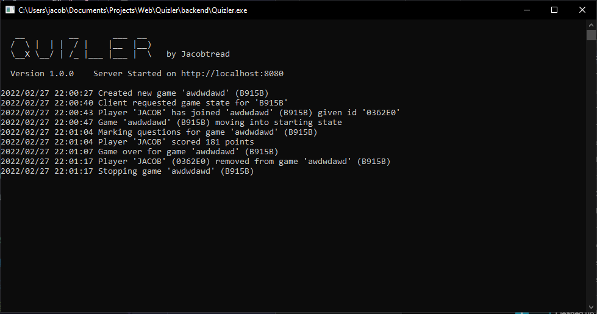

# ❓ Quizler

This app is deployed to [https://quizler.jacobtread.com/](https://quizler.jacobtread.com/)

Quizler is a real time quiz app I am making which is similar to games like [Kahoot](https://kahoot.com/). The app is
fully real time and uses VueJS for its front-end and has a backend server written in Go; The whole thing communicates
via a WebSocket packet system.

The packet system packet descriptions are available [Here](backend/packets.md)

This repository is a mono-repo it contains the code for both the front-end and back-end of
this application they are stored in sub folders of this repository

## New and improved 

This app has been revised and greatly improved upon, you can find this new version at https://github.com/jacobtread/Quizler

## Docker Image

Quizler is fully dockerized, and you can easily deploy it to docker using this GitHub repository. There is an included
Dockerfile in the root of this repository.

## Environment Variables

| NAME            | DEFAULT | DESCRIPTION                                        |
|-----------------|---------|----------------------------------------------------|
| QUIZLER_ADDRESS | 0.0.0.0 | This is the address that the server should bind on |
| QUIZLER_PORT    | 8080    | This is the port that the server should bind on    |

## Showcase

You can view an up-to-date gif of the app
[Here](https://gyazo.com/6b23868be9b649b507f35b7b7a9bb8ee)

and a slightly older gif below

# Server Showcase

